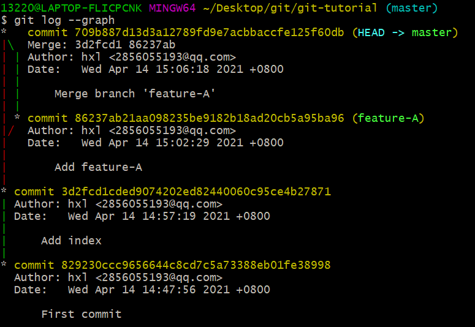
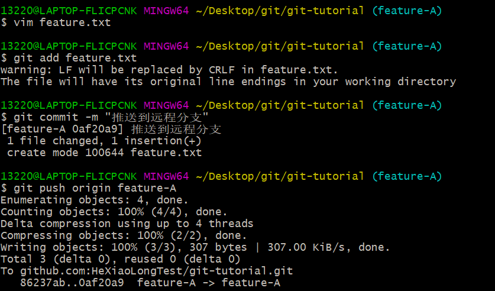

---  
title: git 基本操作  
date: 2021/4/14 16:00:00  
tags:  
- git  
categories:  
- 工具  
--- 

## git的基本操作

初始全局配置

``` cmd
git config --global user.name "hxl"
git config --global user.email "1322076165@qq.com"
```

### git init 初始化仓库

要使用Git进行版本管理，必须先初始化仓库。  

Git是使用git init命令进行初始化的。如果初始化成功，执行了git init命令的目录下就会生成.git目录。
这个.git目录里存储着管理当前目录内容所需的仓库数据。

在Git中，我们将这个目录的内容称为"附属于该仓库的工作树"。文件的编辑等操作在工作树中进行，然后记录到仓库中，以此管理文件的历史快照。如果想将文件恢复到原先的状态，可以从仓库中调取之前的快照，在工作树中打开。

开发者可以通过这种方式获取以往的文件。


### git status 查看仓库的状态

git status命名用于显示Git仓库的状态。

工作树和仓库在被操作的过程中，状态会不断发生变化。在Git操作过程中时常用git status命令查看当前状态。


结果显示了我们当前正处于master分支下。  
接着还显示了没有可提交的内容。


### git add 向暂存区中添加文件

要想让文件成为Git仓库的管理对象，就需要用git add命令将其加入暂存区中。  
暂存区是提交之前的一个临时区域。


### git commit 保持仓库的历史记录

git commit命令可以将当前暂存区中的文件实际保存到仓库的历史记录中。  
通过这些记录，我们就可以在工作树中复原文件。  
记述一行提交信息  


\-m 参数后的"First commit"称作提交信息，是对这个提交的概述。

记述详细提交信息  
如果想要记述得更加详细，请不要加\-m,直接执行git commit命令。  
执行后编辑器就会启动，并显示如下结果。

``` text
# Please enter the commit message for your changes. Lines starting
# with '#' will be ignored, and an empty message aborts the commit.
#
# On branch master
# Changes to be committed:
#    new file:   hello.txt
#
```

在编辑器中记述提交信息的格式如下  
第一行：用一行文件简述提交的更改内容  
第二行：空行  
第三行以后：记述更改的原因和详细内容  
只要按照上面的格式输入，今后便可以通过确认日志的命令或工具看到这些记录。

中止提交  
如果在编辑器启动后想中止提交，请将提交信息留空并直接关闭编辑器，随后提交就会被中止。

### git log 查看提交日志

git log命令可以查看以往仓库中提交的日志。

包括可以查看什么人在什么时候进行了提交或合并，以及操作前后有怎样的差别。


commit栏旁边显示的是指向这个提交的哈希值。  
Git的其他命令中，在指向提交时会用到这个哈希值。

只显示提交信息的第一行  
git log命令后加上 \-\-pretty=short


只显示指定目录，文件的日志  
只要在git log命令后加入目录名，便会只显示该目录下的日志。  
如果加的是文件名，就会只显示与该文件相关的日志。  


显示文件的改动  
如果想查看提交所带来的改动，可以加上\-p参数，文件前后差别就会显示在提交信息之后。

``` text
git log \-p
```


### git diff 查看更改前后的差别

git diff命令可以查看工作树，暂存区，最新提交之间的差别。


\+表示新添加的行  
被删除的行是用\-


习惯：在执行git commit命令之前先执行git diff HEAD命令，查看本次提交与上次提交之前有什么差别，等确认完毕后再进行提交。  
这里的HEAD是指向当前分支中最新一次提交的指针。


## 分支的操作

在进行多个并行作业时，我们会用到分支，在这类并行开发的过程中，往往同时存在多个最新代码状态。

master分支是Git默认创建的分支，因此基本上所有开发都是以这个分支为中心进行的。  
不同分支中，可以同时进行完全不同的作业，等该分支的作业完成之后再与master分支合并。  

与分支相关的Git操作

### git branch    显示分支一览表

git branch命令可以将分支名列表显示，同时可以确认当前所在的分支。


可以看到master分支左侧有`*`，表示这是我们当前所在的分支。  
也就是说，我们正在master分支下进行开发。  
结果中没有显示其他分支名，表示本地仓库中只存在master一个分支。  

`git checkout -b`  创建，切换分支  

如果想以当前的master分支为基础创建新的分支，使用`git checkout -b`命令。
切换到`feature-A`分支并进行提交


创建名为`feature-A`的分支  
实际上，连续执行下面两条命令也能收到同样的效果

``` text
//创建新分支feature-A
git branch feature-A
//创建并切换到feature-A
git checkout feature-A
```

创建`feature-A`分支，并将当前分支切换为`feature-A`分支。

查看分支列表


显示我们处于`feature-A`分支下  
`feature-A`分支左侧标有`*`，表示当前分支为`feature-A`。

在这个状态下像正常开发那样修改代码，执行git add命令并进行提交的话，代码就会提交至`feature-A`分支。


切换到master分支


此时master中的README.md文件保持原来的状态，并没有添加文字。


`feature-A`分支的更改不会影响到master分支，这正是在开发中创建分支的优点。  
只要创建多个分支，就可以在不互相影响的情况下同时进行多个功能的开发。  

切换回上一个分支


像上面这样用`-`代替分支名，就可以切换至上一个分支。(Linux中 - 表示上一个工作目录)

特性分支  

特性分支顾名思义，是集中实习单一特性，除此之外不进行任何作业的分支。  

在日常开发中，往往会创建数个特性分支，同时在此之外再保留一个随时可以发布软件的稳定分支。  
稳定分支的角色通常由master分支担当，基于特定主题的作业在特性分支中进行，主题完成后再与master分支合并。  
只要保持这样一个开发流程，就能保证master分支可以随时供人查看。这样一来，其他开发者也可以放心大胆地从master分支创建新的特性分支。

主干分支

主干分支是刚才我们讲解的特性分支的原点，同时也是合并的终点。  
通常人们会用master分支作为主干分支。  
主干分支中并没有开发到一半的代码，可以随时供他人查看。  

### git merge 合并分支

假设`feature-A`已经实现完毕，想要将它合并到主干分支master中，首先切换到master分支。


然后合并`feature-A`分支。

为了在历史记录中明确记录下本次分支合并，我们需要创建合并提交，因此，在合并时加上`--no-ff`参数。


随后编辑器启动，用于录入合并提交的信息。

``` text
Merge branch 'feature-A'
# Please enter a commit message to explain why this merge is necessary,
# especially if it merges an updated upstream into a topic branch.
#
# Lines starting with '#' will be ignored, and an empty message aborts
# the commit.
```


这样`feature-A`分支的内容就合并到master分支中了。

### `git log --graph` 以图表形式查看分支

`git log --graph`命令可以用表图形式输出提交日志  
用`git log --graph`命令进行查看的话，能很清楚地看到特性分支`(feature-A)`提交的内容已被合并，除此之外，特性分支创建以及合并也都清楚明了。



`git log --graph`命令可以用图表形式输出提交日志。

## 更改提交的操作

### git reset 回溯历史版本

通过前面的学习的操作，我们已经学会如何在实现功能后进行提交，累积提交日志作为历史记录，借此不断培育一款软件。Git的另一个特性便是可以灵活操作历史版本。借助分散仓库的优势，可以在不影响其他仓库的前提下对历史版本进行操作。

回溯历史，创建`fix-B`分支  
回溯到创建`feature-A`分支之前  

要让仓库的HEAD 暂存区 当前工作树回溯到指定状态，需要用到`git reset --hard`命令。

只要提供目标时间的哈希值，就可以完全恢复至改时间点的状态。


我们已经成功回溯到特性分支创建之前的状态。  
由于所有文件都回溯到了指定哈希值对应的时间点上，README.md文件的内容也恢复到了当时的状态。


创建`fix-B`分支


修改`README.md`文件并提交


我们的目标是主干分支合并`feature-A`分支的修改后，又合并了`fix-B`的修改。

推进至`feature-A`分支合并后的状态

首先恢复到`feature-A`分支合并后的状态。不妨称这一操作为推进历史，git log命令只能查到以当前状态为终点的历史记录。所以这里要使用git reflog命令，查看当前仓库的操作日志。

在日志中找出回溯历史之前的哈希值，通过`git reset --hard`命令恢复到回溯历史前的状态。


执行git reflog命令，查看当前仓库执行过的操作日志


在日志中，我们可以看到commit checkout reset merge等Git命令的执行记录。

只要不进行Git的GC`(Garbage Collection,垃圾回收)`，就可以通过日志随意调取近期的历史状态，就像给时间机器指定一个时间点，在过去未来中自由穿梭一般。即便开发者错误执行了Git操作，基本也都可以利用git reflog命令恢复到原先的状态，所以请牢记本部分内容。

从上面数第四行表示feature\-A特性分支合并后的状态，对应的哈希值为709b887

我们将HEAD 暂存区 工作树恢复到这个时间点的状态。（哈希值只要输入4位以上就可以执行\)


消除冲突

现在只要合并`fix-B`分支，就可以得到我们想要的状态。


这时，系统告诉我们README.md文件发生了冲突`(Conflict)`

系统在合并README.md文件时，feature\-A分支更改的部分与本次想要合并的fix\-B分支更改的部分发生了冲突，不解决冲突就无法完成合并，所以我们打开README.md文件，解决这个冲突。

查看冲突部分并将其解决

用编辑器打开README.md文件，就会发现内容变成了如下的样子。


======以上部分是当前HEAD的内容，以下部分是要合并的`fix-B`分支中的内容。

我们在编辑器中将其改成想要的样子。


本次修正让`feature-`与`fix-B`的内容并存于文件之中。

但是实际的软件开发中，往往需要删除其中之一，所以各位在处理冲突时，务必要仔细分析冲突部分的内容后再进行修改。

提交解决后的结果

冲突解决后，执行git add命令与git commit命令。


### `git commit --amend` ——修改提交信息

要修改上一条提交信息，可以使用`git commit --anamed`命令。

上一条提交信息记为了Fix Conflict，但是它其实是`fix-B`分支的合并，解决合并时发生的冲突只是过程之一，这样标记实在不妥，于是，我们要修改这条信息。


编辑器打开

``` text
Fix conflict

# Please enter the commit message for your changes. Lines starting
# with '#' will be ignored, and an empty message aborts the commit.
#
# Date:      Wed Apr 14 15:43:44 2021 +0800
#
# On branch master
# Changes to be committed:
#    modified:   README.md
#
```

修改为`merge branch fix-B`


`git rebase -i`    压缩历史

在合并特性分支之前，如果发现已提交的内容中有些拼写错误，不妨提交一个修改，然后将这个修改包含到前一个提交之中，压缩成一个历史记录。

创建一个`feature-C`分支


修改拼写错误


提交


实际上，我们不希望在历史记录中看到这类提交，因为健全的历史记录并不需要它们。

如果能在最初提交之前就发现并修正这些错误，也就不会出现这类提交了。

### 更改历史

将"Fix typo"修正的内容与之前一次的提交合并，在历史记录中合并为一次完美的提交，为此，我们要用到git rebase命令。


用上述方式执行git rebase命令，可以选定当前分支中包含HEAD（最新提交）在内的两个最新历史记录为对象，并在编辑器中打开。

``` text
pick dab3538 Add feature-C
pick e8a2a55 Fix typo

# Rebase 4de8a09..e8a2a55 onto 4de8a09 (2 commands)
#
# Commands:
# p, pick <commit> = use commit
# r, reword <commit> = use commit, but edit the commit message
# e, edit <commit> = use commit, but stop for amending
# s, squash <commit> = use commit, but meld into previous commit
# f, fixup <commit> = like "squash", but discard this commit's log message
# x, exec <command> = run command (the rest of the line) using shell
# b, break = stop here (continue rebase later with 'git rebase --continue')
# d, drop <commit> = remove commit
# l, label <label> = label current HEAD with a name
# t, reset <label> = reset HEAD to a label
# m, merge [-C <commit> | -c <commit>] <label> [# <oneline>]
# .       create a merge commit using the original merge commit's
# .       message (or the oneline, if no original merge commit was
# .       specified). Use -c <commit> to reword the commit message.
#
# These lines can be re-ordered; they are executed from top to bottom.
#
# If you remove a line here THAT COMMIT WILL BE LOST.
#
# However, if you remove everything, the rebase will be aborted.
#
# Note that empty commits are commented out

```

我们将e8a2a55的Fix typo的历史记录压缩到dab3538的Add feature\-C里。  
将e8a2a55左侧的pick部分删除，改写为fixup，保留编辑器里的内容，关闭编辑器。


系统显示rebase成功。也就是以下面这两个提交作为对象，将"Fix typo"的内容合并到了上一个提交"`Add feature-C`",

改写成了一个新的提交。


`Add feature-C`的哈希值已经不是dab3538,

这证明提交已经被更改。

这样一来，Fix typo就从历史中被抹去，也就相当于`Add feature-C`中从来没有出现过拼写错误。
合并至maseter分支


master分支合并了`feature-C`分支，开发进展顺利。

## 推送至远程仓库

Git是分散型版本管理系统，我们前面学习的，都是针对单一本地仓库的操作。下面，我们将开始接触远在网络另一头的远程仓库。

远程仓库顾名思义，是与我们本地仓库相对独立的另一个仓库。让我们先在GitHub上创建一个仓库，并将其设置为本地仓库的远程仓库。


### git remote add 添加远程仓库

在Github上创建的仓库路径为

``` text
git@github.com:HeXiaoLongTest/git-tutorial.git
```

现在我们用git remote add命令将它设置成本地仓库的远程仓库。


按照上述格式执行git remote add命令之后，Git会自动将

``` text
git@github.com:HeXiaoLongTest/git-tutorial.git
```

远程仓库的名称设置为`origin(标识符)`

### git push 推送至远程仓库

#### 推送至master分支

如果想将当前分支下本地仓库中的内容推送给远程仓库，需要用到git push命令。现在假定我们在master分支下进行操作。


像这样指定git push命令，当前分支的内容就会被推送到远程仓库origin的master分支。

`-u`参数可以在推送到同时，将origin仓库的master分支设置为本地仓库当前分支的`upstream(上游)`。

添加了这个参数，将来运行git pull命令从远程仓库获取内容时，本地仓库的这个分支就可以直接从origin的master分支获取内容，省去了另外添加参数的麻烦。

执行该操作之后，当前本地仓库master分支的内容将会被推送到GitHub的远程仓库中，在GitHub上也可以确认远程master分支的内容和本地master分支相同。

#### 推送至master以外的分支

除了master分支之外，远程仓库也可以创建其他分支。  
举个例子，我们在本地仓库中创建feature\-D分支，并将它以同名形式push至远程仓库。



## 从远程仓库获取

学习从远程仓库获取内容的相关操作。  
这就相当于我们刚刚执行过push操作的目标仓库又有了另一名新开发者来共同开发。

### git clone 获取远程仓库

首先我们换到其他目录下，将GitHub上的仓库clone到本地。


执行git clone命令后我们会默认处于master分支下，同时系统会自动将origin设置成该远程仓库的表示符。  
也就是说，当前本地仓库的master分支与GitHub端的远程仓库`（origin)`的master分支在内容上是完全相同的。
